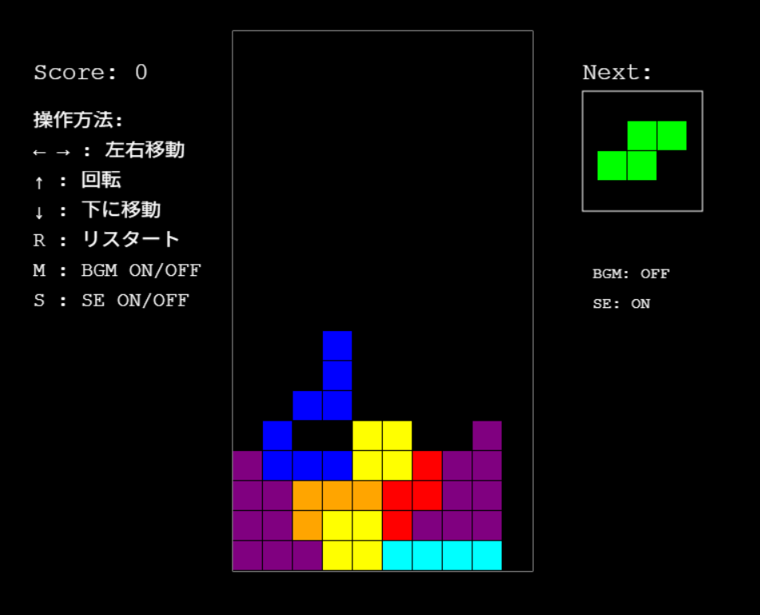

# tetris
1st trial of making tetris

## テトリスゲームの説明

このプロジェクトは、Phaser 3を使用して実装されたテトリスゲームです。

## ゲーム画面

### ゲームの特徴
- クラシックなテトリスのゲームプレイ
- 次のブロックのプレビュー表示
- スコア表示
- BGMと効果音の実装
- ゲームオーバー時のリスタート機能

### 操作方法
- 左右矢印キー: ブロックの左右移動
- 上矢印キー: ブロックの回転
- 下矢印キー: ブロックを下に移動
- Rキー: ゲームオーバー時にリスタート
- Mキー: BGMのON/OFF切り替え
- Sキー: 効果音のON/OFF切り替え

### スコアシステム
- 1ライン消去: 100点
- 複数ライン同時消去: ライン数 × 100点

### 音声機能
- BGM: テトリス風のメロディをWeb Audio APIで生成
- 効果音:
  - ブロック回転音
  - 移動音
  - 着地音
  - ライン消去音
  - ゲームオーバー音
